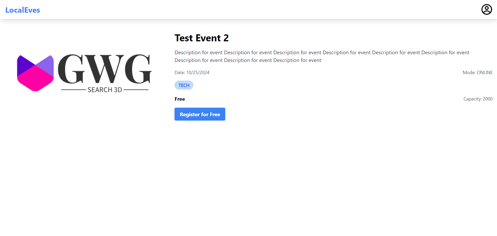

# Event Management System

A comprehensive event management system built with React, allowing users to organize, participate in, and manage events efficiently.

## Table of Contents

- [Features](#features)
- [Screenshots](#screenshots)
- [Contributing](#contributing)
- [License](#license)

## Features

### User Authentication

- **Login**: Secure user authentication system.
- **Signup**: New user registration with role selection (Organiser or Participant).
- **Role-based Access**: Different interfaces and permissions for Organisers and Participants.

### Event Management

- **Create Events**: Organisers can post new events with detailed information.
- **View Events**: Users can view event details, including description, date, mode, and more.

### Event Participation

- **Browse Events**: Participants can view all available events.
- **Register for Events**: Easy registration process for participants.
- **View Registered Events**: Participants can see a list of events they've registered for.

### Organiser Features

- **Organiser Dashboard**: Overview of created events.
- **Manage Attendees**: View event attendees.

### Participant Features

- **Participant Dashboard**: Quick access to registered events and upcoming event suggestions.

### General Features

- **Responsive Design**: Works seamlessly on desktop and mobile devices.
- **Toast Notifications**: User-friendly notifications for actions and alerts.
- **Navigation**: Easy-to-use navbar with context-aware menu items.

## Screenshots

### Organiser Home Page

### Participant Home Page

### Event Creation

### Organiser Event View

### Participant Event View

## Contributing

Contributions are welcome! Please feel free to submit a Pull Request.

## License

This project is licensed under the [MIT License](LICENSE).
